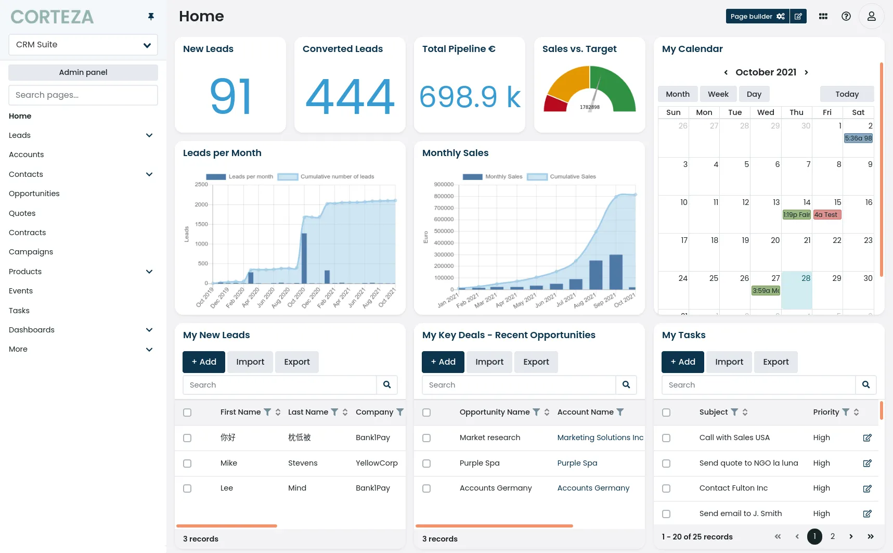

# Corteza CI/CD pipeline

Deploy Corteza server with CI/CD on Elestio

 
 

# Once deployed ...

You can open Corteza UI here:

    URL: https://[CI_CD_DOMAIN]
    email: [ADMIN_EMAIL]
    password: [ADMIN_PASSWORD]

You can open Corteza Admin UI here:

    URL: https://[CI_CD_DOMAIN]/admin
    email: [ADMIN_EMAIL]
    password: [ADMIN_PASSWORD]

You can open PgAdmin web UI here:

    URL: https://[CI_CD_DOMAIN]:8924
    email: [ADMIN_EMAIL]
    password: [ADMIN_PASSWORD]
